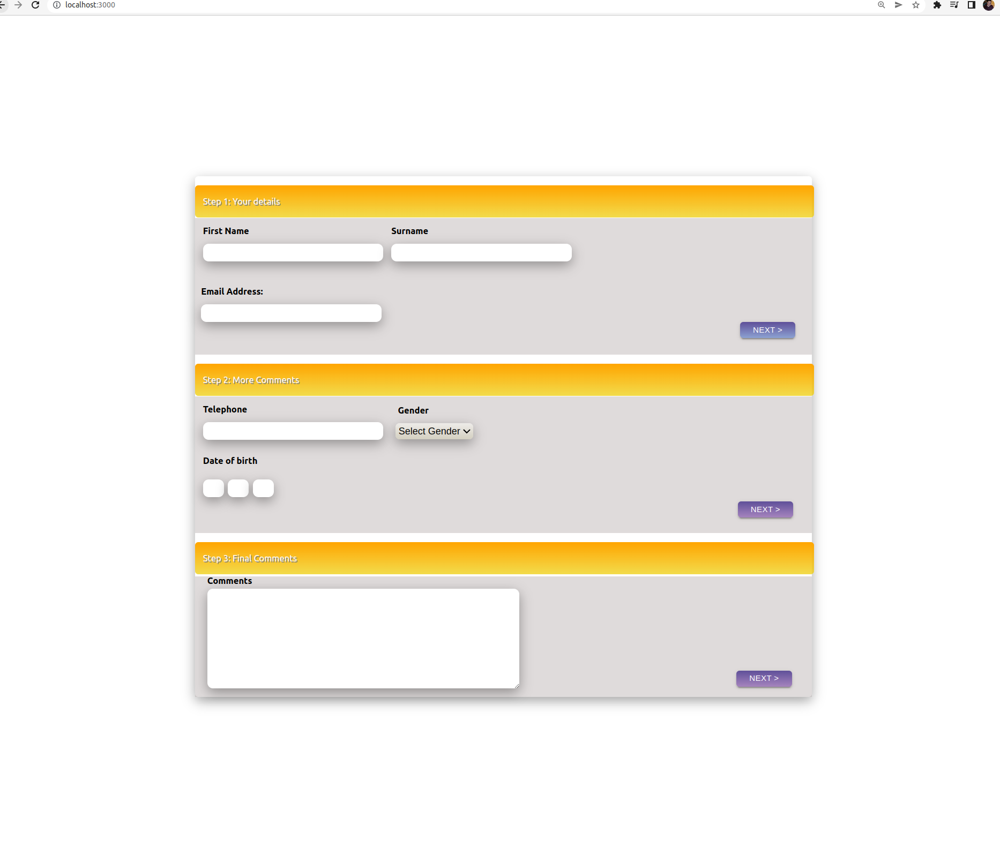
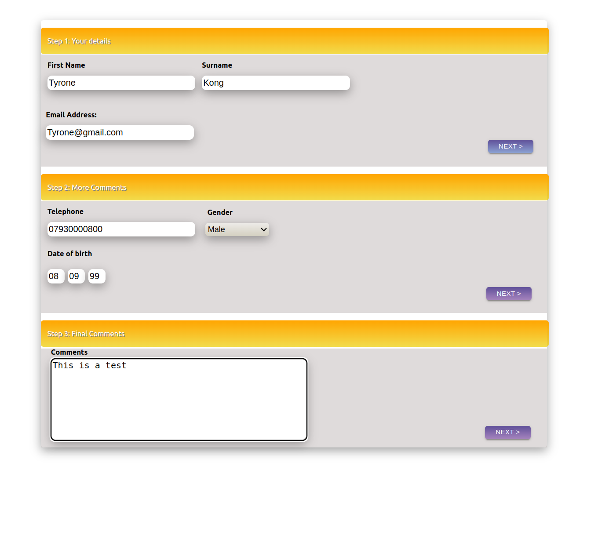
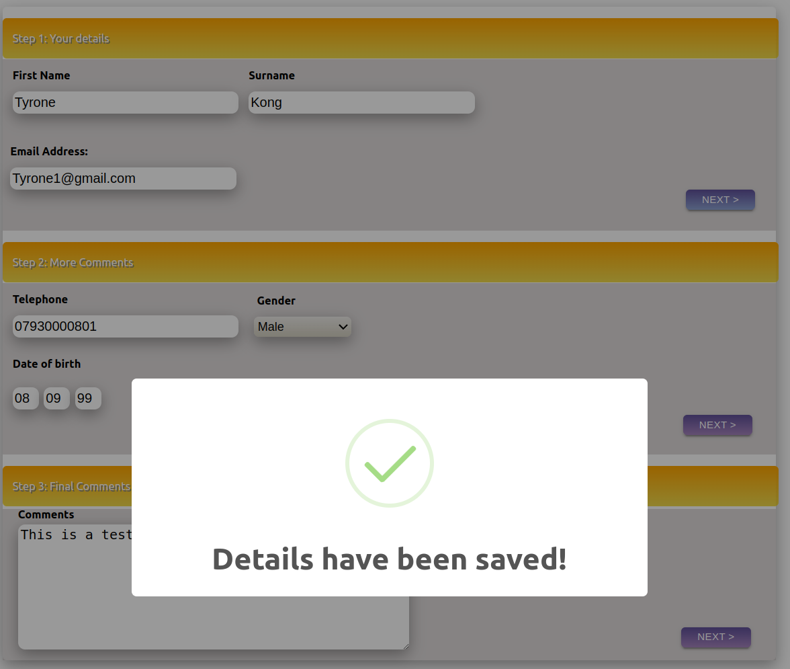
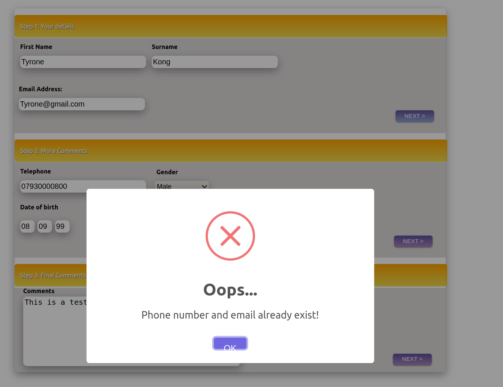
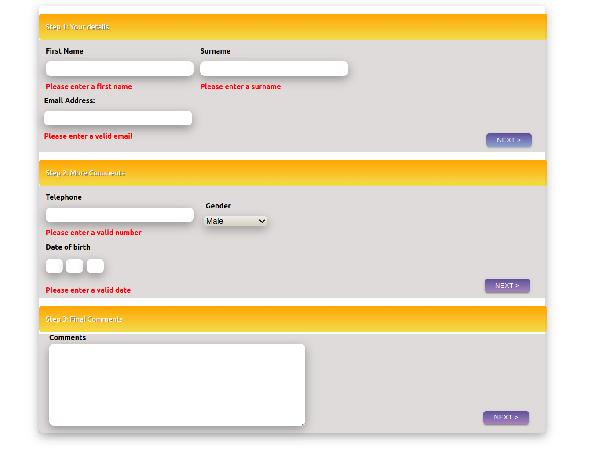
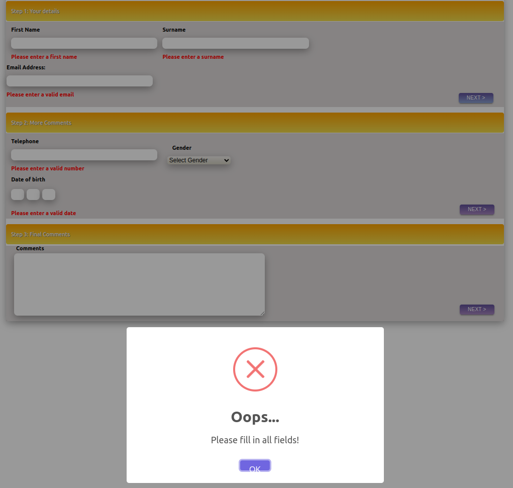
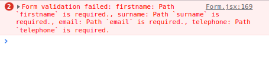
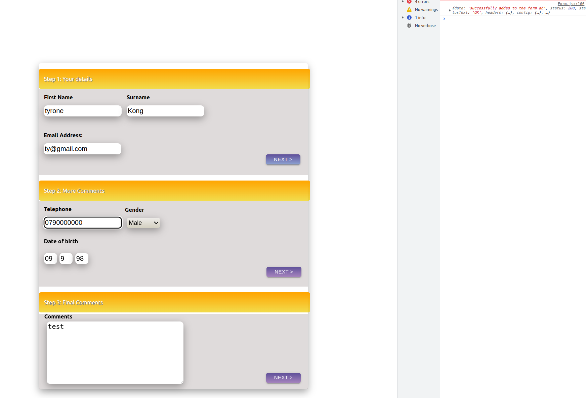
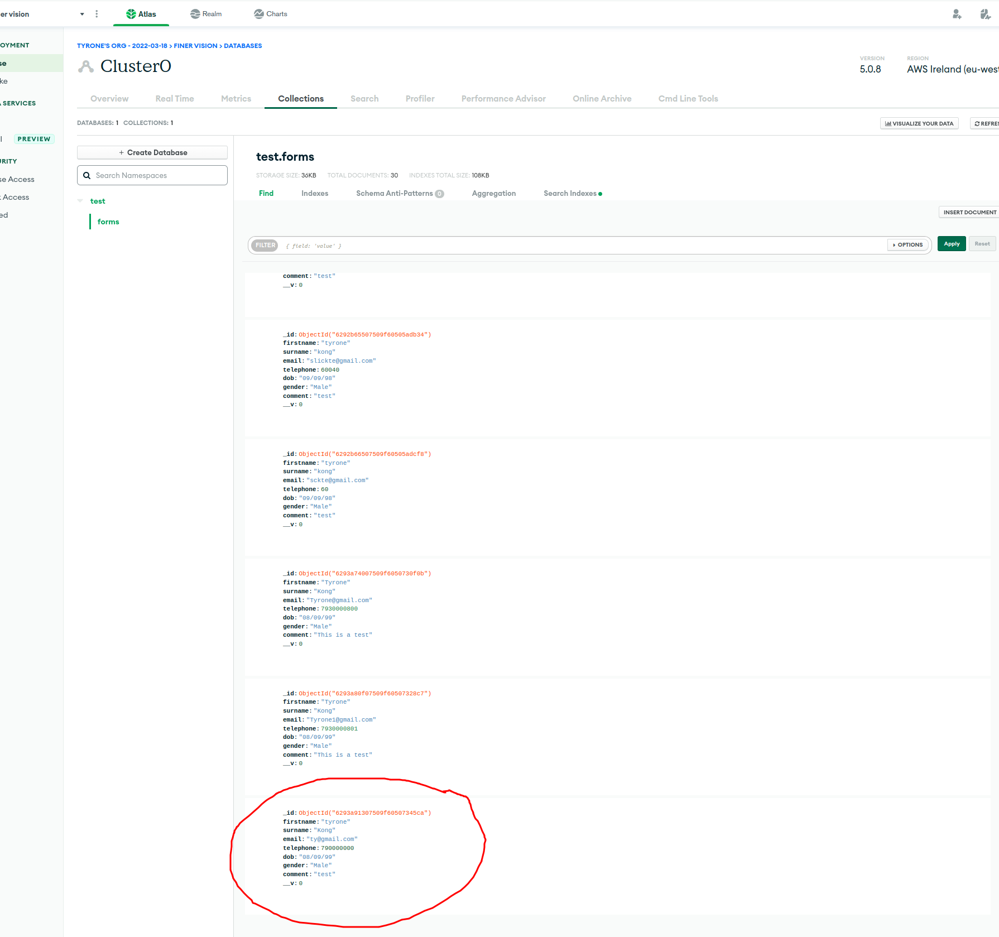

# Finer-Vision

A form with validation
## Table of contents

  - [Screenshot](#screenshot)
  - [Built with](#built-with)
  - [How to install](#how-to-install)

### Screenshot

#### Desktop

### Built with
React, Nodejs, express, MongoDB

## How to install

* Download repo and cd into Server folder and run npm i and run node server.js. The URI has been provided.
* cd into FinerVisionForm folder and run npm i.
* Then npm run dev.
* Once server up and running 'listening on port 8080 and MongoDB database connection successful' is displayed in the terminal.

Server PORT is 8080

